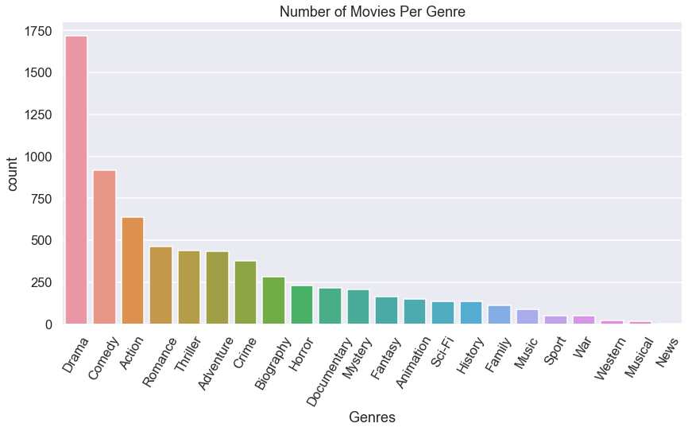

# MICROSOFT MOVIE STUDIO ANALYSIS

Author: John Elvis

## Overview 
This project employs exploratory data analysis to extract valuable information for Microsoft, aiming to establish a new movie studio. By analyzing datasets from IMDB and Box Office Mojo, the project provides recommendations regarding the film genres that Microsoft should consider exploring. 

The success and popularity of each genre are evaluated using two key metrics: the total gross incomes and the critical response. The results suggest that Microsoft would benefit from concentrating on genres such as Sci-Fi, adventure, animation, and action, as these genres have demonstrated higher total gross income.

## Business Problem

Microsoft intends to join the league of prominent companies by venturing into the production of unique video content. To accomplish this, they plan to establish a movie studio. However, their lack of expertise in the field poses a challenge. This analysis primarily focuses on examining the prevailing trends in successful movies at the box office. Through an exploratory data analysis, valuable insights are generated, which can be used by the head of Microsoft's new movie studio to make informed decisions regarding the genres and themes of films to produce.

Questions : 
Which genre of movies have the highest gross income? 
Which genre of movies have a higher average rating? 
What is the relationship between the average rating and the gross income? 
What is the domestic gross and foreign gross income by start year of the movies? 

## Data

The datasets utilized for this analysis are sourced from IMDB and Box Office Mojo. The following is a brief overview of the three datasets:
- imdb.title.basics: Contains info about movie titles such as primary title, original title, start year, runtime minutes  and genres.
- imdb.title.ratings: Contains the IMDb rating and votes information for titles.
- bom.movie_gross: Contains the domestic gross and foreign gross for the movie titles.

## Methods
This project employs exploratory descriptive analysis using several essential steps to gain valuable insights. The process involves importing necessary libraries and loading the datasets, understanding the data, performing data cleaning, and finally, visualizing the data for a comprehensive exploration.

## Results of this analysis
Among the genres present in this dataset, drama, comedy, and action stand out with the highest number of movie releases. Drama and comedy likely hold the title of the most extensive film genres due to their inclusivity of a wide range of films.

The diffrenece in heights between the bars, which correspond to the average ratings, is relatively small. Documentary, biography, and sport genres exhibit the highest average ratings, whereas family, thriller, and horror genres showcase the lowest average ratings.

Box office Mojo tracks theatrical box office earnings. The genres with the highest income are Sci-Fi, adventure, animation and action while the genres with the lowest income are romance, documentary and war.

The correlation between the total gross income and the average rating is not evident. However, it is apparent that movies with an average rating below 4 tend to have a lower total gross income.

Over the years, it has been observed that the foreign gross income of movies tends to surpass their domestic gross income upon release. The movies released in 2018 achieved the highest foreign and domestic gross incomes. However, the gross incomes experienced a sharp decline for movies released in 2019, reaching their lowest point during that year.

## Conclusions and recommendations
In this project, I have analyzed, cleaned, and interpreted data to provide recommendations on the types of movies Microsoft should consider producing for the launch of their new movie studio. 

The main criteria utilized to assess success in this endeavor are the 'total gross sales,' which encompass both the domestic box office gross and the foreign box office gross. 
The genres of movie with the highest total gross sales are: 

>- Sci-Fi
>- Adventure
>- Animation
 
- The most prevalent genres among the released movies are drama, comedy, and action.
- Based on the available dataset, the popularity and success of a genre can be determined by considering either the genre's average rating or its total gross income.
- Documentary, biography, and sport genres have the highest average rating, while Sci-Fi, adventure, animation, and action genres have the highest total gross income. Interestingly, despite having the highest average rating, documentary and biography genres generate very low income. There appears to be no clear relationship between total gross income and average rating.
- To maximize returns on their investment, Microsoft should focus on genres with the highest total gross income, namely Sci-Fi, adventure, animation, and action. These genres seem to attract a wide audience, leading to significant theatrical box office earnings.

## Future work
- Additional investigation is necessary to identify the most optimal time of the year for releasing movies of specific genres.
- It would be advantageous to explore whether increasing the production, development, marketing, and advertising budgets of a movie proportionally impacts the total gross income of its genre. This analysis could aid in predicting profits based on the budget allocated.
- Apart from theatre earnings, studios generate revenue from various sources such as home entertainment sales, rentals, television rights, product placement fees, and streaming services. Collecting data on these revenue streams and comparing them with theatre earnings is crucial for a better analysis of a movie's overall financial performance.

## Repository Structure
├── images                                         <- generated from code  
├── zippedData                                     <- sourced externally   
├── README.md                                      <- The top-level README for reviewers of this project  
├── presentation.pdf                               <- PDF version of project presentation  
└── student.ipynb                                  <- Narrative documentation of analysis in Jupyter notebook  